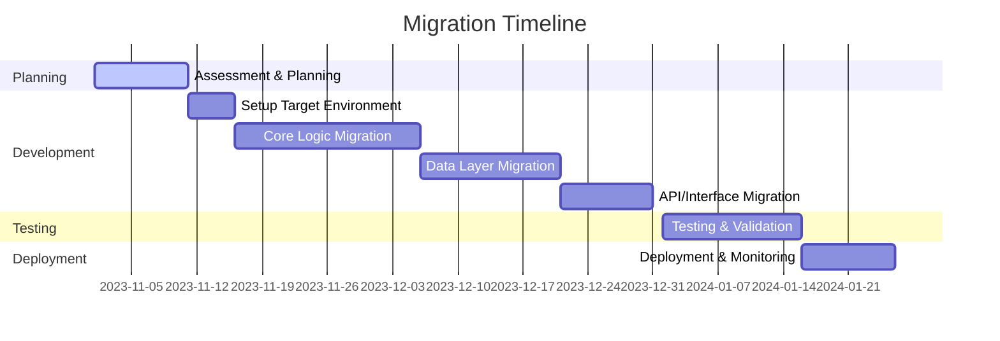

# MIGRATION_PLAN.md

## Migration Plan: Java to Python

### **Executive Summary**
This document outlines a comprehensive plan for migrating the `repository` codebase from Java to Python. The migration addresses the technical, organizational, and operational aspects required to ensure a smooth transition. The repository, currently built with a Java-heavy backend (76.56% Java), utilizes technologies such as Spring Boot and React. The target language, Python, will streamline development, reduce maintenance costs, and improve overall productivity due to Python's simplicity and extensive ecosystem.

The migration will follow a phased approach to minimize risks, ensure functional parity, and maintain stakeholder confidence. A rollback strategy and detailed validation steps will safeguard against disruptions in the production environment.

---

### **Migration Strategy Overview**

The migration strategy is divided into **seven key steps**:
1. **Assessment & Planning**: Analyze the current system, dependencies, and critical components to design a robust migration plan.
2. **Setup Target Environment**: Establish a Python-based development environment, configure tooling, and set up the project structure.
3. **Core Logic Migration**: Translate business logic, algorithms, and data structures from Java to Python.
4. **Data Layer Migration**: Migrate database models, queries, and data access layers to Python's ORM tools.
5. **API/Interface Migration**: Convert the API endpoints, request/response handlers, and supporting middleware.
6. **Testing & Validation**: Ensure the functional and performance parity of the migrated code through rigorous testing.
7. **Deployment & Monitoring**: Deploy the Python-based application in production, monitor performance, and address any post-deployment issues.

---

### **Detailed Migration Steps**

#### **1. Assessment & Planning**
- **Description**: Analyze the Java codebase, identify dependencies, and plan the migration strategy.
- **Tasks**:
  - Document the current architecture, including modules, services, and workflows.
  - List all dependencies (e.g., libraries, frameworks) and assess Python alternatives.
  - Identify critical components (e.g., business-critical functions, high-risk modules).
- **Technical Requirements**:
  - Access to the full source code repository.
  - Dependency analysis tools like `Maven Dependency Plugin` for Java.
  - Tools for static code analysis (e.g., SonarQube).
- **Checklist**:
  - [ ] Architecture documentation completed.
  - [ ] Dependencies mapped to Python equivalents.
  - [ ] Critical modules marked for prioritization.
- **Risk Assessment & Mitigation**:
  | **Risk**                 | **Impact** | **Likelihood** | **Mitigation**                                      |
  |--------------------------|------------|----------------|----------------------------------------------------|
  | Missing architecture docs| High       | Medium         | Conduct code walkthroughs with developers.        |
  | Incorrect dependency mapping | Medium | Medium         | Cross-check with Python community best practices. |
- **Output**:
  - Migration strategy finalized.
  - Stakeholders sign off on the plan.

---

#### **2. Setup Target Environment**
- **Description**: Establish the Python development environment, project structure, and tools.
- **Tasks**:
  - Install Python (3.x) and necessary frameworks (e.g., Flask, Django).
  - Setup project structure adhering to Python best practices (e.g., `src/`, `tests/`).
  - Configure build tools (e.g., `pip`, `virtualenv`, `Poetry`).
- **Technical Requirements**:
  - Python 3.x installed.
  - IDE/editor with Python support (e.g., PyCharm, VS Code).
  - Dependency management tools.
- **Checklist**:
  - [ ] Development environment setup.
  - [ ] CI/CD pipeline reconfigured for Python.
  - [ ] Python frameworks installed.
- **Output**:
  - Base Python project ready for migration.

---

#### **3. Core Logic Migration**
- **Description**: Translate core business logic and algorithms from Java to Python.
- **Tasks**:
  - Map Java classes and functions to Python modules and methods.
  - Adapt Java-specific constructs (e.g., `HashMap`, `List`) to Python equivalents (`dict`, `list`).
  - Ensure the same algorithmic behavior.
- **Technical Requirements**:
  - Code translation tools (e.g., OpenRewrite, manual mapping).
  - Testing framework (e.g., `pytest`).
- **Checklist**:
  - [ ] Core Java classes translated.
  - [ ] Logic validated with unit tests.
  - [ ] Data structures adapted.
- **Code Example**:
  ```java
  // Java
  Map<String, Integer> counts = new HashMap<>();
  counts.put("key", 1);
  ```

  ```python
  # Python
  counts = {"key": 1}
  ```
- **Output**:
  - Core logic retains functional parity.

---

#### **4. Data Layer Migration**
- **Description**: Port database models and queries to Python.
- **Tasks**:
  - Convert database schema to Python ORM (e.g., SQLAlchemy, Django ORM).
  - Translate SQL queries to ORM syntax.
  - Migrate database access layers.
- **Technical Requirements**:
  - Database migration tools (e.g., Alembic for SQLAlchemy).
- **Checklist**:
  - [ ] Database schema ported.
  - [ ] ORM queries converted.
  - [ ] Data access layer tested.
- **Risk Assessment**:
  | **Risk**             | **Impact** | **Likelihood** | **Mitigation**               |
  |----------------------|------------|----------------|------------------------------|
  | Schema mismatch      | High       | Medium         | Validate schema with tests.  |
- **Output**:
  - Python-based data layer operational.

---

#### **5. API/Interface Migration**
- **Description**: Convert API endpoints, request/response handlers, and middleware.
- **Tasks**:
  - Rewrite API routes using Flask/Django.
  - Adapt middleware for authentication and logging.
- **Technical Requirements**:
  - Python web frameworks.
- **Checklist**:
  - [ ] API routes migrated.
  - [ ] Request/response handlers rewritten.
  - [ ] Middleware tested.
- **Code Example**:
  ```java
  // Spring Boot
  @GetMapping("/users")
  public ResponseEntity<List<User>> getUsers() {
      return ResponseEntity.ok(userService.getAllUsers());
  }
  ```

  ```python
  # Flask
  @app.route("/users", methods=["GET"])
  def get_users():
      return jsonify(user_service.get_all_users())
  ```
- **Output**:
  - API interface functional in Python.

---

#### **6. Testing & Validation**
- **Description**: Test the migrated codebase for functionality and performance.
- **Tasks**:
  - Port/write unit tests.
  - Conduct integration and performance testing.
- **Technical Requirements**:
  - Testing frameworks (`pytest`, `unittest`).
- **Checklist**:
  - [ ] Unit tests pass.
  - [ ] Integration tests validated.
  - [ ] Performance benchmarks achieved.
- **Output**:
  - Fully tested Python application.

---

#### **7. Deployment & Monitoring**
- **Description**: Deploy the Python-based application and monitor its performance.
- **Tasks**:
  - Configure CI/CD pipelines.
  - Deploy to staging for final validation.
  - Deploy to production and set up monitoring.
- **Technical Requirements**:
  - CI/CD tools (e.g., GitHub Actions).
  - Monitoring tools (e.g., Prometheus, New Relic).
- **Checklist**:
  - [ ] CI/CD pipeline operational.
  - [ ] Production deployment successful.
  - [ ] Monitoring alerts configured.
- **Output**:
  - Python application live in production.

---

### **Timeline and Milestones**



---

### **Resource Requirements**
- **Team**:
  - 2 Python developers.
  - 1 Database engineer.
  - 1 DevOps engineer.
  - 1 QA engineer.
- **Tools**:
  - Python 3.x, Flask/Django, SQLAlchemy, pytest.
  - CI/CD tools (e.g., GitHub Actions).

---

### **Success Criteria and Metrics**
- All unit tests achieve 90%+ pass rate.
- Performance benchmarks match/exceed Java implementation.
- Zero critical issues post-deployment.

---

### **Rollback Procedures**
- Maintain Java application in production during migration.
- Use feature flags to toggle between Java and Python services.

---

### **Post-Migration Validation Checklist**
- [ ] Verify API endpoints.
- [ ] Validate database consistency.
- [ ] Monitor error logs and performance metrics. 

--- 

